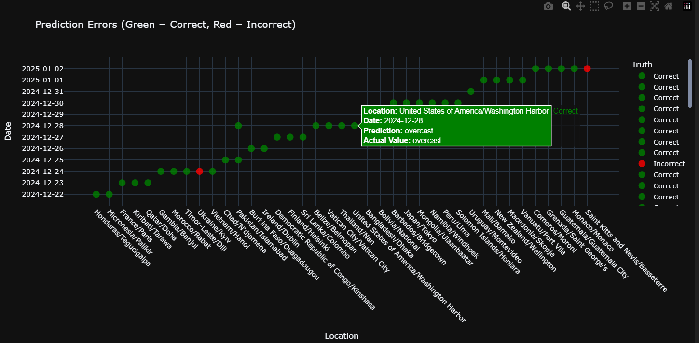

# Global Weather Prediction and Analysis

## Project Description
This project aims to analyze global weather data and make weather predictions using machine learning techniques. The dataset is updated daily, allowing the model to predict and test performance on newly added data.

## Technologies and Libraries Used
This project utilizes the following Python libraries:
- `pandas`, `numpy`: Data processing
- `seaborn`, `matplotlib`, `plotly`: Visualization
- `sklearn`: Machine learning models and data preprocessing
- `prince`: PCA analysis
- `scipy`: Statistical analysis

## Dataset
The project uses the **GlobalWeatherRepository.csv** dataset, which includes:
- Location (country, city)
- Temperature (Celsius and Fahrenheit)
- Wind speed and direction
- Pressure, humidity, air quality
- Sunrise/sunset times
- Weather conditions (rainy, snowy, foggy, etc.)

## Data Preprocessing and Cleaning
- Removed unnecessary and highly correlated variables.
- Handled missing values appropriately.
- Converted categorical variables into numerical form using `LabelEncoder`.
- Identified and handled outliers using Z-score analysis.
- Normalized data using `PowerTransformer`.

## Machine Learning Models
Three different machine learning models were used in this project:
1. **K-Nearest Neighbors (KNN)**: Used for weather classification.
2. **Logistic Regression**: Trained to classify weather conditions.
3. **Random Forest**: Applied to achieve robust predictions.

### Model Performance Results
- **KNN Model**:
  - Mean Accuracy: **77%** (after PCA transformation)
  - Before PCA: **50%**
- **Logistic Regression Model**:
  - Mean Accuracy: **82%**
- **Random Forest Model**:
  - Mean Accuracy: **96%** (Best performing model)

Among the models, **Random Forest** achieved the highest accuracy.

## Visualizations
- Correlation matrix
- PCA transformations and component analysis
- K-Means clustering results
- Model accuracy analysis and error visualizations
- 

## Conclusion and Future Work
This project compares different machine learning algorithms to improve weather predictions. Future enhancements could include using larger datasets and deep learning techniques to further enhance performance.

**Developers:**
- **Arda Ağaçdelen**
- **Ali Emre Arar**
- **Alihan Ertekin**